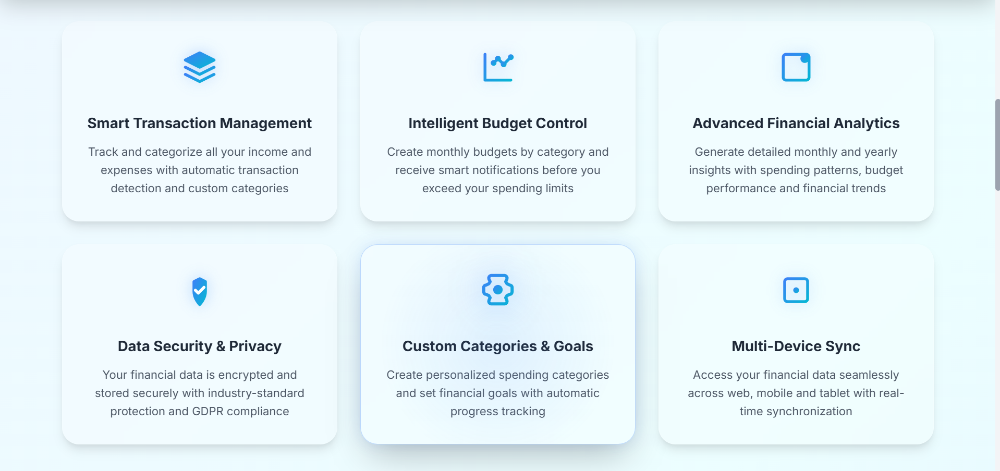
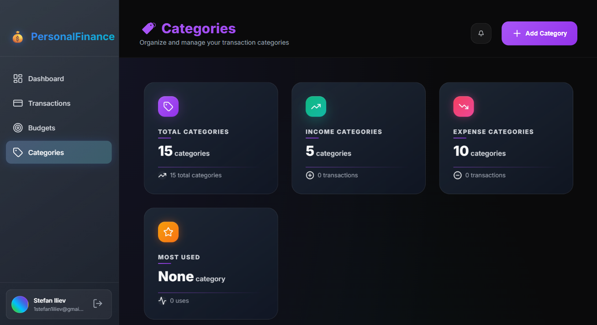

# 💰 PersonalFinance - Smart Financial Management System

<div align="center">

🏗️ **Built with:** Spring Boot 3.2 • Java 21 • MySQL 8.0+ • JavaScript ES6+ • Bootstrap 5.3

⚡ **Technologies:** Spring Security 6 • Hibernate • Maven • JPA • REST API

**A comprehensive Spring Boot application for managing personal finances with enterprise-grade security and modern user experience**

</div>

---

## 📸 Application Screenshots

### 🎯 Landing Page Experience

*Modern landing page showcasing the core value proposition with clean design and clear call-to-action.*


*Comprehensive feature overview highlighting smart transaction management, budget control, and advanced analytics.*


*Streamlined registration process with traditional signup form and convenient Google OAuth2 integration.*

### 🏠 Financial Dashboard

*Real-time financial overview displaying current balance, monthly income/expenses, and key performance metrics.*


*Advanced budget performance tracking and category allocation analysis with visual progress indicators.*


*Monthly performance insights with spending velocity tracking and financial health scoring.*


*Detailed financial insights including spending patterns, budget adherence rates, and actionable recommendations.*

### 💳 Transaction Management

*Clean transaction interface with comprehensive filtering options and intuitive empty state guidance.*


*User-friendly transaction creation form with category selection, amount input, and date picker.*


*Advanced filtering system allowing users to sort transactions by type, period, category, and amount range.*

### 📊 Budget Planning

*Budget management dashboard showing total budget, spending progress, and health indicators.*


*Intelligent budget creation form with general/category options and customizable alert settings.*


*Helpful empty state encouraging users to create their first budget with clear guidance.*


*Sophisticated filtering system for organizing budgets by type, status, and category.*

### 🏷️ Category Organization  

*Category management dashboard with statistics showing total, income, and expense categories distribution.*


*Intuitive category creation interface with type selection, naming, and color customization options.*


*Organized category listing showing default categories with usage statistics and management options.*


*Advanced category filtering with type, usage status, origin, and search functionality.*


*Fast category creation shortcuts for both income and expense categories with visual guidance.*

---

## 💡 What is PersonalFinance?

PersonalFinance is a complete web-based financial management platform designed to help individuals take control of their money and make informed financial decisions. Built with modern web technologies, it provides a secure, intuitive environment for tracking your financial life.

### **Core Purpose**

PersonalFinance solves the common problem of scattered financial information by centralizing all your money management in one secure platform. Whether you're trying to understand where your money goes, stick to a budget, or simply get organized financially, this application provides the tools you need.

### **What You Can Do**

**📊 Track Every Transaction**
- Record all your income and expenses with detailed categorization
- See your real-time account balance and financial position
- View spending patterns over different time periods
- Organize transactions by custom categories with color coding

**💰 Smart Budget Management** 
- Create monthly budgets for overall spending or specific categories
- Monitor your progress with visual indicators and spending percentages  
- Get automatic alerts when you're approaching (90%) or exceeding (100%) your budget limits
- Compare planned vs actual spending to improve future budgeting

**🎯 Intelligent Notifications**
- Receive real-time alerts when budgets are at risk
- Stay informed about your financial activity through the notification system
- Get email notifications for important account activities

**🔐 Secure Multi-Platform Access**
- Sign in with your email and password or use Google OAuth2 for convenience
- Access your data securely from any device with responsive design
- All financial data is encrypted and protected with enterprise-grade security

**📈 Financial Insights**
- Analyze spending trends across different time periods
- View detailed breakdowns by income and expense categories
- Track your financial progress with comprehensive reporting
- Export and review your financial data whenever needed

### **Who Benefits**

- **Individuals** wanting to understand their spending habits and improve financial discipline
- **Budget-conscious users** who need alerts and tracking to stay within limits  
- **Privacy-focused people** who want to keep financial data secure and self-hosted
- **Anyone** looking to move from spreadsheets or multiple apps to one comprehensive solution

PersonalFinance transforms financial management from a chore into an empowering experience, giving you the clarity and control needed to achieve your financial goals.

---

## 🎯 Key Features

### 💳 **Financial Management Core**
- **📊 Transaction Tracking** - Comprehensive income and expense management with real-time balance calculation
- **📈 Budget Planning** - Monthly budget creation with category-specific limits and progress tracking
- **🚨 Smart Alerts** - Automated notifications when approaching or exceeding budget thresholds (90%, 100%)
- **📋 Category Management** - Custom expense/income categories with color coding and archival system
- **📊 Financial Reports** - Advanced analytics with monthly/yearly comparisons and spending insights

### 🔐 **Enterprise Security**
- **🔑 Multi-Authentication** - Traditional form-based login + Google OAuth2 integration
- **📧 Email Verification** - Secure account activation with token-based confirmation
- **🔄 Password Management** - Robust password reset system with expiring tokens
- **🛡️ Session Security** - Advanced session management with concurrent login prevention
- **⚠️ Security Alerts** - Email notifications for suspicious account activities

### 🌐 **User Experience**
- **📱 Responsive Design** - Mobile-first approach with modern UI/UX
- **🌍 Internationalization** - Full UTF-8 support with Bulgarian language integration
- **⚡ Real-time Validation** - Frontend validation with backend security checks
- **🎨 Customization** - Personalized dashboard with user preferences

---

## 📁 Project Structure

<details>
<summary>🗂️ Complete project structure overview</summary>

```
src/
├── main/
│   ├── java/
│   │   └── com.example.personal_finance_app/
│   │       ├── Config/
│   │       │   ├── PasswordConfig.java
│   │       │   └── SecurityConfig.java
│   │       ├── Controller/
│   │       │   ├── AuthController.java
│   │       │   ├── BudgetAlertController.java
│   │       │   ├── BudgetController.java
│   │       │   ├── CategoryController.java
│   │       │   ├── EmailValidationController.java
│   │       │   ├── PageController.java
│   │       │   ├── PasswordResetController.java
│   │       │   ├── TransactionController.java
│   │       │   └── UserController.java
│   │       ├── Entity/
│   │       │   ├── Budget.java
│   │       │   ├── BudgetAlert.java
│   │       │   ├── Category.java
│   │       │   ├── EmailConfirmationToken.java
│   │       │   ├── PasswordResetToken.java
│   │       │   ├── Transaction.java
│   │       │   └── User.java
│   │       ├── Enum/
│   │       │   ├── AlertType.java
│   │       │   ├── AuthProvider.java
│   │       │   └── TransactionType.java
│   │       ├── Exception/
│   │       │   ├── BudgetNotFoundException.java
│   │       │   ├── CategoryNotFoundException.java
│   │       │   ├── DuplicateCategoryException.java
│   │       │   ├── InsufficientPermissionException.java
│   │       │   ├── TransactionNotFoundException.java
│   │       │   ├── UserAlreadyExistsException.java
│   │       │   └── UserNotFoundException.java
│   │       ├── Repository/
│   │       │   ├── BudgetAlertRepository.java
│   │       │   ├── BudgetRepository.java
│   │       │   ├── CategoryRepository.java
│   │       │   ├── EmailConfirmationTokenRepository.java
│   │       │   ├── PasswordResetTokenRepository.java
│   │       │   ├── TransactionRepository.java
│   │       │   └── UserRepository.java
│   │       ├── Service/
│   │       │   ├── BudgetAlertService.java
│   │       │   ├── BudgetService.java
│   │       │   ├── CategoryService.java
│   │       │   ├── CustomOAuth2User.java
│   │       │   ├── CustomOAuth2UserService.java
│   │       │   ├── EmailService.java
│   │       │   ├── EmailValidationService.java
│   │       │   ├── PasswordResetService.java
│   │       │   ├── TransactionService.java
│   │       │   └── UserService.java
│   │       └── PersonalFinanceAppApplication.java
│   └── resources/
│       ├── static/
│       │   ├── components/
│       │   │   └── sidebar.html
│       │   ├── css/
│       │   │   ├── budgets.css
│       │   │   ├── categories.css
│       │   │   ├── dashboard.css
│       │   │   ├── landing.css
│       │   │   ├── shared.css
│       │   │   └── transactions.css
│       │   ├── js/
│       │   │   ├── budgets.js
│       │   │   ├── categories.js
│       │   │   ├── dashboard.js
│       │   │   ├── landing.js
│       │   │   ├── shared.js
│       │   │   └── transactions.js
│       │   ├── budgets.html
│       │   ├── categories.html
│       │   ├── dashboard.html
│       │   ├── index.html
│       │   └── transactions.html
│       ├── templates/
│       └── application.properties
```

### **Architecture Overview**

| Package | Purpose | Key Components |
|---------|---------|----------------|
| **Config** | Application configuration | Security, Password encoding |
| **Controller** | REST API endpoints | Authentication, CRUD operations |
| **Entity** | Database entities | JPA entities with relationships |
| **Enum** | Enumeration types | Transaction types, Auth providers |
| **Exception** | Custom exceptions | Business logic exceptions |
| **Repository** | Data access layer | JPA repositories |
| **Service** | Business logic layer | Core application services |
| **Static** | Frontend resources | HTML, CSS, JavaScript files |

</details>

---

## 🚀 Quick Start

### **Prerequisites**
- ☕ **Java 21+** - [Download OpenJDK](https://openjdk.org/install/)
- 🗄️ **MySQL 8.0+** - [Download MySQL](https://dev.mysql.com/downloads/)
- 📧 **SMTP Email Account** - Gmail recommended
- 🔑 **Google OAuth2 Credentials** - [Google Cloud Console](https://console.cloud.google.com/)

### **⚡ 3-Step Quick Setup**

```bash
# 1. Clone the repository
git clone https://github.com/yourusername/personal-finance-app.git
cd personal-finance-app

# 2. Set environment variables (see Configuration section)
cp .env.example .env
# Edit .env with your database and email credentials

# 3. Run the application
./mvnw spring-boot:run
```

🎉 **Access your application at:** `http://localhost:8080`

---

## ⚙️ Detailed Installation

<details>
<summary>📋 Step-by-step installation guide</summary>

### **1. System Requirements**

| Component | Minimum | Recommended |
|-----------|---------|-------------|
| Java | 21 | 21+ |
| RAM | 512MB | 2GB+ |
| Storage | 100MB | 500MB+ |
| MySQL | 8.0 | 8.0+ |

### **2. Database Setup**

```sql
-- Create database
CREATE DATABASE personalfinance_db 
CHARACTER SET utf8mb4 
COLLATE utf8mb4_unicode_ci;

-- Create user (optional)
CREATE USER 'pf_user'@'localhost' IDENTIFIED BY 'your_secure_password';
GRANT ALL PRIVILEGES ON personalfinance_db.* TO 'pf_user'@'localhost';
FLUSH PRIVILEGES;
```

### **3. Google OAuth2 Setup**

1. Go to [Google Cloud Console](https://console.cloud.google.com/)
2. Create a new project or select existing
3. Enable Google+ API
4. Create OAuth2 credentials:
   - **Application type:** Web application
   - **Authorized redirect URIs:** `http://localhost:8080/login/oauth2/code/google`
5. Copy Client ID and Client Secret

### **4. Email Configuration**

For Gmail SMTP:
1. Enable 2-Factor Authentication
2. Generate App Password
3. Use these settings:
   - Host: `smtp.gmail.com`
   - Port: `587`
   - Username: your email
   - Password: app password

### **5. Environment Configuration**

Create `.env` file in project root:

```env
# Database Configuration
DB_URL=jdbc:mysql://localhost:3306/personalfinance_db?useSSL=false&serverTimezone=UTC
DB_USERNAME=pf_user
DB_PASSWORD=your_secure_password

# Google OAuth2
GOOGLE_CLIENT_ID=your_google_client_id
GOOGLE_CLIENT_SECRET=your_google_client_secret
OAUTH_REDIRECT_URI=http://localhost:8080/login/oauth2/code/google

# Email Configuration
EMAIL_HOST=smtp.gmail.com
EMAIL_PORT=587
EMAIL_USERNAME=your_email@gmail.com
EMAIL_PASSWORD=your_app_password

# Server Configuration
PORT=8080
```

### **6. Build and Run**

```bash
# Clean and compile
./mvnw clean compile

# Run tests
./mvnw test

# Start application
./mvnw spring-boot:run

# Or build JAR and run
./mvnw clean package
java -jar target/personal-finance-app-1.0.0.jar
```

</details>

---

## 🔧 Configuration Guide

<details>
<summary>⚙️ Detailed configuration options</summary>

### **Application Properties Structure**

The application uses `application.properties` with environment variables for secure configuration:

```properties
# Server Configuration
server.port=${PORT:8080}

# UTF-8 Encoding (Bulgarian Language Support)
server.servlet.encoding.charset=UTF-8
server.servlet.encoding.enabled=true
server.servlet.encoding.force=true

# Database Configuration
spring.datasource.url=${DB_URL}
spring.datasource.username=${DB_USERNAME}
spring.datasource.password=${DB_PASSWORD}
spring.datasource.driver-class-name=com.mysql.cj.jdbc.Driver

# JPA/Hibernate Configuration
spring.jpa.hibernate.ddl-auto=update
spring.jpa.show-sql=false
spring.jpa.properties.hibernate.dialect=org.hibernate.dialect.MySQL8Dialect
spring.jpa.properties.hibernate.connection.characterEncoding=utf8

# Google OAuth2 Configuration
spring.security.oauth2.client.registration.google.client-id=${GOOGLE_CLIENT_ID}
spring.security.oauth2.client.registration.google.client-secret=${GOOGLE_CLIENT_SECRET}
spring.security.oauth2.client.registration.google.scope=profile,email

# Email Configuration
spring.mail.host=${EMAIL_HOST}
spring.mail.port=${EMAIL_PORT}
spring.mail.username=${EMAIL_USERNAME}
spring.mail.password=${EMAIL_PASSWORD}
spring.mail.properties.mail.smtp.auth=true
spring.mail.properties.mail.smtp.starttls.enable=true
```

### **Security Configuration Highlights**

- **Password Encoding:** BCrypt with strength 12
- **Session Management:** Maximum 1 concurrent session per user
- **CSRF Protection:** Disabled for API endpoints, enabled for forms
- **OAuth2 Integration:** Google provider with profile and email scopes
- **Custom Filters:** User validation and session cleanup

### **Email Templates**

The system includes professional email templates for:
- ✅ Account verification
- 🔄 Password reset
- 🎉 Welcome messages
- ⚠️ Security alerts

</details>

---

## 📖 API Documentation

The PersonalFinance application provides a comprehensive REST API for managing financial data, user authentication, and system configuration.

### **Authentication Endpoints**

**User Registration & Login**
- `POST /api/auth/register` - User registration with email verification
- `POST /api/auth/login-error` - Login error handling with detailed error messages
- `GET /api/auth/current-user` - Get current authenticated user information
- `GET /api/auth/confirm-email` - Email confirmation via token
- `POST /api/auth/resend-confirmation` - Resend confirmation email

**OAuth2 Integration**
- Google OAuth2 login is handled automatically through `/oauth2/authorization/google`
- Successful OAuth2 login redirects to `/dashboard`

### **User Management**

**Profile Management**
- `GET /api/users/profile` - Get user profile information
- `PUT /api/users/profile` - Update user profile (name, preferences)
- `PUT /api/users/password` - Change user password
- `GET /api/users/check-email` - Check if email address is available

### **Transaction Management**

**CRUD Operations**
- `GET /api/transactions` - Get all user transactions with pagination
- `POST /api/transactions` - Create new income or expense transaction
- `GET /api/transactions/{id}` - Get specific transaction details
- `PUT /api/transactions/{id}` - Update existing transaction
- `DELETE /api/transactions/{id}` - Delete transaction

**Financial Analytics**
- `GET /api/transactions/balance` - Get current account balance
- `GET /api/transactions/current-month` - Get transactions for current month
- `GET /api/transactions/period/{year}/{month}` - Get transactions for specific period

### **Budget Management**

**Budget Creation & Management**
- `GET /api/budgets` - Get all user budgets
- `POST /api/budgets/general` - Create general monthly budget
- `POST /api/budgets/category` - Create category-specific budget
- `GET /api/budgets/current-month` - Get current month budgets with spending progress
- `PUT /api/budgets/{id}` - Update budget amount
- `DELETE /api/budgets/{id}` - Delete budget

**Budget Analytics**
- `GET /api/budgets/period/{year}/{month}` - Get budgets for specific period
- `GET /api/budgets/general/{year}/{month}` - Get general budget for period
- `PUT /api/budgets/update-spent/{year}/{month}` - Refresh spent amounts

### **Category Management**

**Category Operations**
- `GET /api/categories` - Get active categories for user
- `POST /api/categories` - Create new custom category
- `PUT /api/categories/{id}` - Update category name and color
- `DELETE /api/categories/{id}` - Archive category (soft delete)
- `POST /api/categories/{id}/restore` - Restore archived category

**Category Organization**
- `GET /api/categories/all` - Get all categories including archived
- `GET /api/categories/archived` - Get only archived categories
- `GET /api/categories/type/{type}` - Get categories by type (INCOME/EXPENSE)
- `GET /api/categories/stats` - Get category statistics

### **Alert & Notification System**

**Budget Alerts**
- `GET /api/alerts` - Get all user alerts
- `GET /api/alerts/unread` - Get unread alerts only
- `GET /api/alerts/unread/count` - Get count of unread alerts
- `PUT /api/alerts/{id}/read` - Mark specific alert as read
- `PUT /api/alerts/read-all` - Mark all alerts as read
- `DELETE /api/alerts/{id}` - Delete specific alert

### **Password Reset System**

**Reset Process**
- `POST /api/password-reset/request` - Request password reset email
- `GET /api/password-reset/validate` - Validate reset token
- `POST /api/password-reset/confirm` - Confirm new password
- `GET /api/password-reset/status` - Check token status

### **Email Validation**

**Email Services**
- `POST /api/email-validation/validate-realtime` - Real-time email validation
- `POST /api/email-validation/validate-registration` - Pre-registration validation
- `POST /api/email-validation/test-email` - Test email configuration

### **API Response Format**

All API endpoints return standardized JSON responses:

**Success Response:**
```json
{
  "success": true,
  "message": "Operation completed successfully",
  "data": {
    // Response data here
  },
  "timestamp": "2024-01-01T12:00:00Z"
}
```

**Error Response:**
```json
{
  "success": false,
  "error": "Error description",
  "errorType": "validation_error",
  "field": "fieldName",
  "timestamp": "2024-01-01T12:00:00Z"
}
```

---

## 🛠️ Development Setup

<details>
<summary>👨‍💻 Development environment configuration</summary>

### **IDE Configuration**

**IntelliJ IDEA (Recommended)**
```xml
<!-- Import Maven project -->
<!-- Enable annotation processing -->
<!-- Set JDK 21+ -->
<!-- Install plugins: Spring Boot, Lombok -->
```

### **Development Profiles**

Create `application-dev.properties`:
```properties
# Development specific settings
spring.jpa.show-sql=true
logging.level.com.example.personal_finance_app=DEBUG
spring.mail.properties.mail.debug=true

# H2 Database for development (optional)
# spring.datasource.url=jdbc:h2:mem:testdb
# spring.h2.console.enabled=true
```

### **Hot Reload Setup**

Add Spring Boot DevTools dependency:
```xml
<dependency>
    <groupId>org.springframework.boot</groupId>
    <artifactId>spring-boot-devtools</artifactId>
    <scope>runtime</scope>
    <optional>true</optional>
</dependency>
```

### **Code Style**

**Formatting Rules:**
- **Indentation:** 4 spaces
- **Line length:** 120 characters
- **Imports:** Organize and remove unused
- **Comments:** JavaDoc for public methods

</details>

---

## 🐳 Deployment Options

<details>
<summary>🚀 Production deployment strategies</summary>

### **Docker Deployment**

**Dockerfile:**
```dockerfile
FROM openjdk:17-jdk-slim

WORKDIR /app

COPY target/personal-finance-app-*.jar app.jar

EXPOSE 8080

ENTRYPOINT ["java", "-jar", "app.jar"]
```

**docker-compose.yml:**
```yaml
version: '3.8'
services:
  app:
    build: .
    ports:
      - "8080:8080"
    environment:
      - DB_URL=jdbc:mysql://db:3306/personalfinance_db
      - DB_USERNAME=root
      - DB_PASSWORD=rootpassword
    depends_on:
      - db
  
  db:
    image: mysql:8.0
    environment:
      - MYSQL_ROOT_PASSWORD=rootpassword
      - MYSQL_DATABASE=personalfinance_db
    ports:
      - "3306:3306"
    volumes:
      - mysql_data:/var/lib/mysql

volumes:
  mysql_data:
```

### **Cloud Deployment**

**Heroku:**
```bash
# Install Heroku CLI
heroku create personal-finance-app

# Set environment variables
heroku config:set DB_URL=your_database_url
heroku config:set GOOGLE_CLIENT_ID=your_client_id

# Deploy
git push heroku main
```

### **Production Considerations**

- **SSL/TLS:** Use Let's Encrypt or AWS Certificate Manager
- **Database:** Use managed services (AWS RDS, Google Cloud SQL)
- **Load Balancing:** Nginx or cloud load balancers
- **Monitoring:** Application metrics and health checks
- **Backup:** Automated database backups
- **Scaling:** Horizontal scaling with session persistence

</details>

---

## 🔐 Security Implementation

<details>
<summary>🛡️ Comprehensive security measures</summary>

### **Authentication Methods**

1. **Form-Based Authentication**
   - BCrypt password hashing (strength 12)
   - Account lockout after failed attempts
   - Email verification required

2. **OAuth2 Integration**
   - Google OAuth2 provider
   - Secure token handling
   - Profile and email scope access

### **Authorization Model**

```java
// Role-based access control
@PreAuthorize("hasRole('USER')")
@GetMapping("/api/transactions")
public ResponseEntity<List<Transaction>> getUserTransactions() {
    // Only authenticated users can access their own data
}
```

### **Security Headers**

```java
// Implemented security headers
- X-Content-Type-Options: nosniff
- X-Frame-Options: DENY
- X-XSS-Protection: 1; mode=block
- Strict-Transport-Security: max-age=31536000
- Content-Security-Policy: default-src 'self'
```

### **Data Protection**

- **Password Storage:** BCrypt hashing with salt
- **Sensitive Data:** Encrypted at rest
- **Database:** Parameterized queries (SQL injection prevention)
- **Input Validation:** Server-side validation for all inputs
- **Output Encoding:** XSS prevention

### **Session Management**

- **Session Timeout:** 30 minutes of inactivity
- **Concurrent Sessions:** Maximum 1 per user
- **Session Fixation:** Protection enabled
- **Secure Cookies:** HttpOnly and Secure flags

### **Email Security**

- **Token Expiration:** Email tokens expire in 24 hours
- **Password Reset:** Tokens expire in 30 minutes
- **Rate Limiting:** Maximum 3 password reset requests per hour
- **Secure Links:** HTTPS-only reset links

### **Security Monitoring**

- **Failed Login Attempts:** Logged and monitored
- **Suspicious Activity:** Email alerts sent
- **Session Hijacking:** Detection and prevention
- **IP Tracking:** Login location monitoring

</details>

---

## 📊 Performance & Monitoring

<details>
<summary>📈 Performance optimization and monitoring</summary>

### **Performance Optimizations**

- **Database Indexing:** Optimized queries with proper indexes
- **Connection Pooling:** HikariCP for efficient database connections
- **Caching:** Spring Cache for frequently accessed data
- **Lazy Loading:** JPA lazy loading for entity relationships
- **Pagination:** API endpoints support pagination for large datasets

### **Key Metrics**

- **Response Time:** < 200ms for API endpoints
- **Database Queries:** Optimized for < 50ms average
- **Memory Usage:** < 512MB baseline
- **Concurrent Users:** Supports 100+ concurrent sessions

### **Logging Strategy**

```properties
# Structured logging configuration
logging.level.com.example.personal_finance_app=INFO
logging.pattern.console=%d{yyyy-MM-dd HH:mm:ss} - %msg%n
logging.file.name=logs/personal-finance.log
```

**Log Categories:**
- 🔐 **SECURITY:** Authentication attempts, authorization failures
- 💰 **BUSINESS:** Transaction creation, budget updates
- ⚠️ **ERROR:** Application errors and exceptions
- 📊 **PERFORMANCE:** Slow queries and response times

</details>

---

## 🐛 Troubleshooting

<details>
<summary>🔧 Common issues and solutions</summary>

### **Common Issues**

#### **1. Database Connection Issues**
```
Error: Cannot connect to MySQL database
```
**Solutions:**
- ✅ Verify MySQL is running: `systemctl status mysql`
- ✅ Check database URL format: `jdbc:mysql://localhost:3306/db_name`
- ✅ Verify credentials and database exists
- ✅ Check firewall settings (port 3306)

#### **2. Email Configuration Issues**
```
Error: Failed to send email
```
**Solutions:**
- ✅ Enable "Less secure app access" for Gmail (or use App Passwords)
- ✅ Verify SMTP settings (host: smtp.gmail.com, port: 587)
- ✅ Check network connectivity to SMTP server
- ✅ Test with email validation endpoint

#### **3. Google OAuth2 Issues**
```
Error: OAuth2 authentication failed
```
**Solutions:**
- ✅ Verify Google client ID and secret
- ✅ Check redirect URI matches Google Console configuration
- ✅ Ensure Google+ API is enabled
- ✅ Clear browser cookies and try again

#### **4. UTF-8 Encoding Issues**
```
Error: Bulgarian characters not displaying correctly
```
**Solutions:**
- ✅ Verify database charset: `utf8mb4_unicode_ci`
- ✅ Check connection URL includes charset parameters
- ✅ Ensure application.properties has UTF-8 settings
- ✅ Verify browser encoding is set to UTF-8

#### **5. Session Issues**
```
Error: User session expired unexpectedly
```
**Solutions:**
- ✅ Check session timeout configuration
- ✅ Verify session registry settings
- ✅ Clear browser cookies and cache
- ✅ Review concurrent session limits

### **Debug Mode**

Enable debug logging:
```properties
logging.level.com.example.personal_finance_app=DEBUG
logging.level.org.springframework.security=DEBUG
spring.mail.properties.mail.debug=true
```

### **Health Checks**

Quick health verification:
```bash
# Application health
curl http://localhost:8080/api/auth/current-user

# Email service
POST http://localhost:8080/api/email-validation/test-email
```

</details>

---

## 🤝 Contributing

<details>
<summary>👥 How to contribute to the project</summary>

### **Getting Started**

1. **Fork the repository**
2. **Create a feature branch:** `git checkout -b feature/amazing-feature`
3. **Make your changes** following the coding standards
4. **Write tests** for new functionality
5. **Commit your changes:** `git commit -m 'Add amazing feature'`
6. **Push to branch:** `git push origin feature/amazing-feature`
7. **Open a Pull Request**

### **Contribution Guidelines**

#### **Code Standards**
- ✅ Follow Google Java Style Guide
- ✅ Write comprehensive unit tests (85%+ coverage)
- ✅ Include JavaDoc for public methods
- ✅ Use meaningful commit messages
- ✅ Keep pull requests focused and small

#### **Testing Requirements**
- ✅ All tests must pass
- ✅ New features require tests
- ✅ Integration tests for API changes
- ✅ Security tests for auth-related changes

#### **Documentation**
- ✅ Update README for new features
- ✅ Add API documentation for new endpoints
- ✅ Include configuration examples
- ✅ Update troubleshooting section if needed

### **Development Workflow**

```bash
# Setup development environment
git clone https://github.com/yourusername/personal-finance-app.git
cd personal-finance-app

# Create feature branch
git checkout -b feature/your-feature-name

# Make changes and test
./mvnw test

# Commit with meaningful message
git commit -m "feat: add budget alerts notification system"

# Push and create PR
git push origin feature/your-feature-name
```

### **Issue Reporting**

When reporting issues, please include:
- 🐛 **Bug Description:** Clear description of the problem
- 🔄 **Steps to Reproduce:** Step-by-step reproduction guide
- 💻 **Environment:** OS, Java version, browser
- 📊 **Expected vs Actual:** What should happen vs what happens
- 📸 **Screenshots:** If applicable

### **Feature Requests**

For new feature requests:
- 💡 **Use Case:** Describe the problem you're solving
- 🎯 **Proposed Solution:** Your suggested approach
- 🔄 **Alternatives:** Other approaches considered
- 📊 **Impact:** How this benefits users

</details>

---

## 📚 Additional Resources

<details>
<summary>📖 Helpful links and documentation</summary>

### **Documentation Links**
- 📘 [Spring Boot Documentation](https://spring.io/projects/spring-boot)
- 🔐 [Spring Security Reference](https://spring.io/projects/spring-security)
- 🗄️ [MySQL Documentation](https://dev.mysql.com/doc/)
- 🔑 [Google OAuth2 Guide](https://developers.google.com/identity/protocols/oauth2)
- 📧 [JavaMailSender Documentation](https://docs.spring.io/spring-framework/docs/current/javadoc-api/org/springframework/mail/javamail/JavaMailSender.html)

### **Tutorials & Guides**
- 🎓 [Spring Boot Security Tutorial](https://spring.io/guides/gs/securing-web/)
- 💰 [Building REST APIs with Spring Boot](https://spring.io/guides/tutorials/rest/)
- 🔄 [OAuth2 Integration Guide](https://spring.io/guides/tutorials/spring-boot-oauth2/)
- 📊 [JPA and Hibernate Tutorial](https://spring.io/guides/gs/accessing-data-jpa/)

### **Tools & Resources**
- 🛠️ [Postman Collection](docs/PersonalFinance-API.postman_collection.json) - API testing
- 📊 [Database Schema](docs/database-schema.sql) - Complete database structure
- 🎨 [UI Components](docs/ui-components.md) - Frontend component documentation
- 🔧 [Development Setup Guide](docs/development-setup.md) - Detailed dev environment setup

### **Community & Support**
- 💬 [GitHub Discussions](https://github.com/yourusername/personal-finance-app/discussions)
- 🐛 [Issue Tracker](https://github.com/yourusername/personal-finance-app/issues)
- 📧 [Email Support](mailto:support@personalfinance.app)
- 💼 [LinkedIn](https://linkedin.com/in/yourprofile)

</details>

---

<div align="center">

**🌟 Star this project if it helped you! ⭐**

**Built with ❤️ and modern Java technologies**

*PersonalFinance - Empowering smart financial decisions*

</div>
